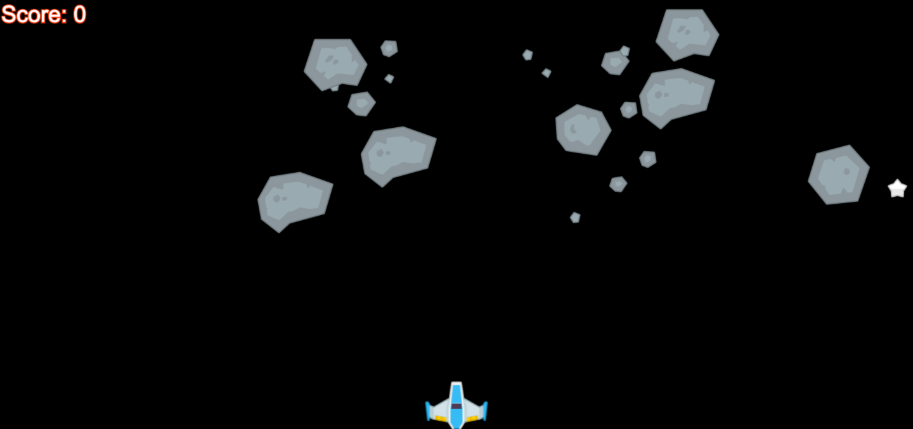

# Learning .filter, .map, .reduce with Asteroids!

A simple asteroids game is being developed where a ship moves left-right on the bottom
of the screen and shoots lasers at asteroids moving in both directions across the screen.
However, the developer has abandoned the project! Oh no! We need your help to complete
the game so it can delivered to millions of people and bring them joy!

## How to get started?

First you need to have these basic things installed:

1. A web browser, yea we all have one
2. Nodejs: Visit this site to find easy steps to install https://nodejs.org/en/download/
3. The code for the game which you can download from  and extract to any folder.

Once you have these installed, there are couple basic commands you need to run
in your console.

On Windows? Press Windows+R to open "Run" box. Type "cmd" and then click "OK" to open a regular Command Prompt.
On Mac? In the Finder, open the /Applications/Utilities folder, then double-click Terminal.

```
cd <folder you extracted the code to>
npm install -g simple-server
simple-server public 3000
```

Now open your browser and type in http://localhost:3000 in the browser URL bar. You should see the
following:



## Your Tasks

You need to help finish the game by calculating the user's score correctly as they destroy the asteroids.

Calculate the new user's score based on asteroids which have been destroyed by lasers, i.e. they have reached a health of 0, and adds each asteroids points to the current user's total score.

In public/js/completeTheGame.js the outline a function is provided, using .filter, .map,
and .reduce help calculate the user's new score.

### calculateTheNewScore

```
/**
 * calculateTheNewScore
 *
 * Calculates the new user's score based on asteroids which have been destroyed
 * by lasers, i.e. they have reached a health of 0, and adds each asteroids
 * points to the current user's total score.
 *
 * listOfAsteroids
 *    An array of asteroid objects which contain the following important
 *    properties.
 *    {
 *       health: <integer> - The asteroids health a value of 0 or more
 *       points: <integer> - The value the asteroid is worth for the user's score when destroyed
 *    }
 * currentScore
 *   The user's current score.
 *
 * Return: The new user's score based on the asteroids that have been destroyed and
 *         how much each asteroid was worth.
 */
```

#### Hints

1. How can you get a new array of just the asteroids with health equal to 0?
2. Once you have an array of destroyed asteroids in #1, how can you get an array of the point values
   from that array of asteroids? (_think .map_)
3. How can you calculate the total of new points starting from the user's currentScore passed in using the array from #2.

#### Solution

An example solution is provided in the solution/ folder, but don't use it until you have completed
the exercise.
